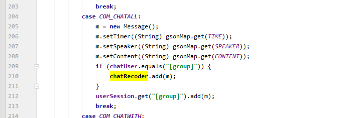
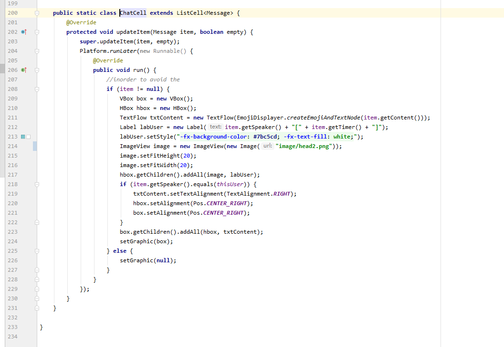

# 写在前面

这个项目借鉴于deleaf大佬，他的项目链接：https://github.com/Dyleaf/WeChat

我将jdbc部分的代码用mybatis替换成功，同时替换了登录界面的图片（狂cd狂cd），下面是我对这个项目的解读。


# 总结（最关键）

## 服务端

启动类localseerver：


masterserver：

```
public class MasterServer {

    /**
     * 用户列表
     */
    private ArrayList<ServerUser> users;

    public ServerSocket masterServer;
    public WorkServer workServer;

    private int port = 8888;

    public void start() {
        users = new ArrayList<ServerUser>();
        try {
            masterServer = new ServerSocket(port);
            try {
                //users = (ArrayList<ServerUser>) UserDaoImpl.getInstance().findAll();
                //下面这条是用的mybatis，但不知道为什么会导致不能显示用户的问题，还是用上面的好了
                //更新：已修复
                users = (ArrayList<ServerUser>) userdaoimpl.getInstance().findAll();
                for (ServerUser u:users) {
                    u.setStatus("offline");
                }
                System.out.println("get user"+users.size());
            } catch (SQLException e) {
                System.out.println("userList init failed");
                e.printStackTrace();
            }
            System.out.println("server loading");
        } catch (IOException e) {
            e.printStackTrace();
        }

        //死循环处理
        while (true) {
            try {
                workServer = new WorkServer(masterServer.accept(), users);
                //workServer继承了Thread，所谓start()就是调用run()方法
                workServer.start();
                System.out.println("workServer product");
            } catch (IOException e) {
                e.printStackTrace();
            }
        }
    }
}
```

masterserver只有一个，

每当有个客户端与masterserver建立socket通信（表现为masterServer.accept()有了结果），masterserver就会创建一个workserver线程，然后启动它，workserver是真正的工作的底层服务器


workserver：

有很多方法，如下：


handlemessage用于处理消息（读来的，即客户端发过来的），

sentmessagetoclient用于向客户端发送消息，

**精简总结**：

每个workserver对接一个客户端的socket，而这个workserver对象的workUser成员就代表那个对接的客户端，在handlemessage中

有如下代码：


session如下：

这个队列实际就是存的message，是指客户端A那边需要传给另一个客户端B的信息，这些信息会先由A发给服务端，存在这个session中，然后，

这个sentmessagetoclient函数会把消息队列中的message一直poll出来直到session这个队列为空，


而事实上，我们的workserver是一个继承了线程的类，即它是一个线程

而它的run方法是一直在死循环的（只要不退出登录）：


以上就是服务端的通信流程。


## 客户端

### 客户端的界面究竟是如何更新的

以chatwindow为例

1.clienmodel里面：

声明：


无参构造：


get和set：


handlemessage里（这个方法就是socket读服务端发来的消息后会调用）：




调用完之后，这个charrecoder就会更新读来的m（message类型）

那么为什么可以显示呢，如下：


2.Mainview里面：


这个chatwindow是一个显示聊天信息的窗口（如下图右边的fxid）：


快了快了，马上就接近事情的真相了。

chatwindow绑定了回调函数：


ps：这个**setCellFactory**函数是干嘛的：


博客链接：https://blog.csdn.net/asdinto/article/details/91524452

总而言之，这个**setCellFactory**和后面的代码配套使用的效果就是可以不断地更新chatwindow，不断地展示内容（而且成员还是一一对应）


内部又使用了ChatCell函数：


可以看到这里的runlater函数（很明显这里和多线程有关，那么就是javafx相关，它会开启一个线程不断执行这个run，时机由javafx决定）。

有关runlater：


这里的run方法体中很明显是对chatwindow的更新，所以我们的信息就这样被更新到gui上面了


### MainView


即这么个玩意，javafx界面左边可以选择跟谁通话，下面有emoji（选择表情），send（发送消息过去）。

emoji绑定函数：btnEmoji

send绑定函数：btnSend

**btnSend**如下：


最终是用一个map作为原始消息实体，然后转化成gson，最后调用clientmodel的sentMessage方法，sentMessage方法如下：


那么发送我们懂了，读消息呢，如下：

在clientmodel的代码中，有两处会调用reader.readline()，如下：


登录的比较简单，只读一次，是初始化相关，我们主要看receivewatchdog，可以看到这是个死循环：


我们真正的处理方法是handlemessage(message)。该方法体如下：

```
private void handleMessage(String message) {
    Map<Integer, Object> gsonMap = GsonUtils.GsonToMap(message);
    Integer command = GsonUtils.Double2Integer((Double) gsonMap.get(COMMAND));
    Message m;
    switch (command) {
        case COM_GROUP:
            HashSet<String> recoder = new HashSet<>();
            for (ClientUser u : userList) {
                if (u.isNotify()) {
                    recoder.add(u.getUserName());
                }
            }
            ArrayList<String> userData = (ArrayList<String>) gsonMap.get(COM_GROUP);
            userList.remove(1, userList.size());
            int onlineUserNum = 0;
            for (int i = 0; i < userData.size(); i++) {
                ClientUser user = new ClientUser();
                user.setUserName(userData.get(i));
                user.setStatus(userData.get(++i));
                if (user.getStatus().equals("online"))
                    onlineUserNum++;
                if (recoder.contains(user.getUserName())) {
                    user.setNotify(true);
                    user.setStatus(user.getStatus() + "(*)");
                }
                userList.add(user);
                userSession.put(user.getUserName(), new ArrayList<>());
            }
            int finalOnlineUserNum = onlineUserNum;
            Platform.runLater(new Runnable() {
                @Override
                public void run() {
                    MainView.getInstance().getLabUserCoumter().setText("服务器在线人数为" + finalOnlineUserNum);
                }
            });
            break;
        case COM_CHATALL:
            m = new Message();
            m.setTimer((String) gsonMap.get(TIME));
            m.setSpeaker((String) gsonMap.get(SPEAKER));
            m.setContent((String) gsonMap.get(CONTENT));
            if (chatUser.equals("[group]")) {
                chatRecoder.add(m);
            }
            userSession.get("[group]").add(m);
            break;
        case COM_CHATWITH:
            String speaker = (String) gsonMap.get(SPEAKER);
            String receiver = (String) gsonMap.get(RECEIVER);
            String time = (String) gsonMap.get(TIME);
            String content = (String) gsonMap.get(CONTENT);
            m = new Message();
            m.setSpeaker(speaker);
            m.setContent(content);
            m.setTimer(time);
            if (thisUser.equals(receiver)) {
                if (!chatUser.equals(speaker)) {
                    for (int i = 0; i < userList.size(); i++) {
                        if (userList.get(i).getUserName().equals(speaker)) {
                            ClientUser user = userList.get(i);
                            if (!user.isNotify()) {
                                //user.setStatus(userList.get(i).getStatus() + "(*)");
                                user.setNotify(true);
                            }
                            userList.remove(i);
                            userList.add(i, user);
                            break;
                        }
                    }
                    System.out.println("标记未读");
                }else{
                    chatRecoder.add(m);
                }
                userSession.get(speaker).add(m);
            }else{
                if(chatUser.equals(receiver))
                    chatRecoder.add(m);
                userSession.get(receiver).add(m);
            }
            break;
        default:
            break;
    }
    System.out.println("服务器发来消息" + message + "消息结束");
}
```

首先要把String类型的message转成gson类型，可见最终处理的结果往往是往usersession中的list加消息，


我们的显示窗口主要是下面这两个：


chatwindow是聊天窗，usergroup是群组及用户表。（上面的图是MainView中的initialize方法中的，可以看作两个显示窗口的初始化）

所以真正更新gui的是图中的两个构造函数chatcell和usercell：




可以看到上面两个构造函数中重写了run方法，说明这里会执行线程

runlater说明：


后面我还是每台想明白，但是大概应该就是通过多线程不断更新窗口吧，更新的内容从消息队列中取。


### 表情

至于表情是如何传输的，中间的javafx过程不多BB，我自己也不太懂，我只知道button绑定函数，javafx本身底层是多线程实现的，

然后我们的表情实际选择后也会是转化成字符串，如下：


可以看到该表情也转成了一串字符串，而我们又有一个emoji的json表，如下：


可以看到非常长，我们查找刚刚的表情，如下：


果然找到了，证实了我们的理解，再配合我们上面的sentmessage，就能传出去了，这个关键字和表情是一一对应的。


# 杂谈

最终还是决定参考dyleaf的javafx+jdbc版本的网络聊天室，我的目标是：

* 修改javafx即gui部分，修改ui界面，让其充满dota元素（比如头像用三国杀+dota选手的那个），头像扩充，外部UI框更换
* 把jdbc代码去掉，改为用mybatis来实现服务端的数据存取
* 测试成功，让项目run起来


最终可以尝试把jre和项目一起打包，然后发布，让同学测试，看看功能是否正常


## 我做了个备份文件夹，可以运行，在F盘的cp文件下

测试后可以运行。

我修改了肥人表情和maybe三国杀头像的版本。2021/2/27晚


# 项目亮点

## 1.发送表情

gson，可序列化的使用，表情到底是怎么传输的，表情文件是所有客户端都存，

传递的实际是一个json，表情存储到本地，通过json（有一个表情的json文件）来一一对应应该加载哪个表情。

通过json简化我们需要传输的信息，但是依然实现表情的发送。

中间有用到gson包，google的Gson类，它可以做map到gson的转化，也可以转化成json（tojson），然后这个作者还写了String到map的转化（也是调库）

## gson


gson就是可以把java对象和json（String）类型互相转化的工具类，主要方法是fromJson和toJson


## 2.对socket编程的使用和封装


## 3.gui界面用javafx编写

比较清晰。。。


## 4.运行测试

有没有给同学使用（我是准备打包成exe文件，然后给同学测试）

我是准备看能不能局域网测试。


## 5.数据库操作用mybatis代替jdbc

成功替代，简化代码编写（虽然也没有用到多少sql，，，但是至少用到的地方确实变简洁了）


## 6通信通过RPC模式和MQ（消息队列）形式实现

两者融合使用，效果还可以（指能运行。。。）

我的网络聊天室的通信是使用的rpc，即客户端之间发送消息需要经过服务器，通过序列化和反序列化传输信息，最后调用服务器函数，把“通信”需求解决，把消息传给对应的接受者，但是我这里并没有同步等待要求返回值，而是传过去后不等，干接下来的事，中间又有一个线程不断读socket输入端的信息，然后存到本地消息队列中（先read，再调用handlemessage处理，最后存到消息队列（usersession和chatrecorder的配套使用）中），还有一个javafx的线程不断根据这个消息更新gui的文本框


## ObservableList的使用


# 项目运行的杂乱问题


## ip问题

刚想了下，还没测试，但是我的主机ip到底应该给别人多少呢

其实这个问题就是内网，外网通信问题，服务端，客户端，一篇有关的博客地址：https://blog.csdn.net/chenlycly/article/details/52344392


## 尝试改成mybatis后的findAll方法返回的serveruser的name属性为null

解决：确定对应关系


## 1复制一个项目的副本打开用不了maven

解决：得打开wechat那一层目录才行


## java文件左下方出现小“j”

修改设置的中的路径，很容易百度到


## URI is not registered (Settings | Languages & Frameworks | Schemas and DTDs)


解决方法：https://blog.csdn.net/weixin_43367967/article/details/85198352


## 棘手的问题

我添加了新的包realdao，以及修改了pom.xml，加了mybatis相关就会导致Mainapp运行抛异常。

现在我在排查到底是什么问题。

控制变量法：我发现别的不变，我只是修改了pom.xml就导致该异常，说明是pom.xml的问题，更准确的说是那个resource的问题


我发现添加了些文件好了一些，还是有些没加载出来


最终修改成下图后最终正确：


# 概述

该项目有bean，client，dao，server，utils五个包


在原版代码中，Dao包里面全是jdbc相关代码，数据库用的是mysql。

Server包是服务器相关，涉及server，socket之类。

utils包是工具类包，里面有一些常量参数，还有个Gson相关。

bean包中的类分别是客户端，消息，服务端的类的逻辑抽象，可以存一些信息，并且前两个继承了Serializable接口。

最为复杂的是Client包，这里面又有chatroom，emojis，Login，model，stage包


## DAO

dao中的sql方法其实并没有所有都被用到，客户端中是不会用到这个方法的，所以我们的sql语句都是在服务端使用的（这也很好理解，本来就没有道理要求客户端也有数据库，数据库我们当然只在服务端保存），经过ctrl+f查询，我发现只在masterserver类中：


以及workserver类中：


可以看到只用到了findall方法和add方法


## 客户端


底层的读写如上，就是简单的流读写机制


# 图解


注意accept()是阻塞方法.

为什么是阻塞方法呢，应该是操作系统方面的原因（客户端没回应，没有必要浪费CPU时间），以下是解释：


# javafx

## 资料

一个简单介绍javafx的csdn博客：https://blog.csdn.net/abc_12366/article/details/79966055


一个比较好的javafx博客地址：https://blog.csdn.net/weixin_30814329/article/details/101701125


## launch(args);

```
public static void main(String[] args) {
    launch(args);
}
```

该方法用于启动Apllication类。


# jdbc加载db-config.properties

我没发现TMD这个狗杂种作者有两个这个db-config.properties同名文件，有一个dbutil类那一个目录，一个在main目录下，真是操了，改的时候两个都要改才行。

而且IDEA删除或添加文件直接运行不一定能检测到，得重新打开项目才行


# gson是干嘛的？

